# 🏠 Digital House - Smart Contracts

<div align="center">


**Decentralized hotel booking platform with auction system and citizen value distribution**

[Documentation](#-documentation) • [Quick Setup](#-quick-setup) • [Deployment](#-deployment) • [Testing](#-testing)

</div>

---

## 📖 Overview

Digital House is a blockchain platform that enables hotel property bookings through an innovative auction system that generates **citizen value** when users cede their reservations to higher bidders.

### 🎯 Key Features

- ✅ **Factory Pattern**: Creation and management of multiple property vaults
- ✅ **Auction System**: Competitive bidding with value distribution
- ✅ **PYUSD Payments**: Stablecoin for stable transactions
- ✅ **Citizen Value**: Rewards for reservation cession
- ✅ **Multi-chain**: Sepolia Ethereum and Arbitrum Sepolia
- ✅ **Advanced Security**: ReentrancyGuard, Ownable, comprehensive validations

---

## 🏗️ Contract Architecture

### DigitalHouseFactory.sol
Factory contract for creating and managing property vaults in a scalable way.

```solidity
function createVault(
    string memory _vaultId,
    string memory _propertyDetails,
    uint256 _basePrice,
    address _realEstateAddress
) external returns (address)
```

**Main Functions:**
- `createVault()` - Create new vault for a property
- `getVaultAddress()` - Get vault address by ID
- `getVaultInfo()` - Complete vault information
- `getAllVaultIds()` - List all vaults
- `getOwnerVaults()` - Vaults by owner

### DigitalHouseVault.sol
Individual contract that manages the complete reservation cycle for a specific property.

**Vault States:**
- `FREE` - Available for new reservation
- `AUCTION` - Active reservation, accepting bids
- `SETTLED` - Check-in completed, process finished

**Reservation Flow:**
1. **Initial Reservation**: User stakes PYUSD
2. **Auction Period**: Other users can bid higher
3. **Cession (Optional)**: Original user can cede to higher bidder
4. **Check-in**: Arrival confirmation and access
5. **Check-out**: Final settlement and payment distribution

### 📊 System Flow Diagram

```mermaid
flowchart TD
    A[🏨 Hotel creates Vault via Factory] --> B{Vault State: FREE}
    
    B --> C[👤 User A creates reservation<br/>Stake: 1,000 PYUSD]
    C --> D{Vault State: AUCTION}
    
    D --> E[⏰ Auction Period<br/>Until 24hrs before check-in]
    
    E --> F{Any bids?}
    F -->|No| M[⏰ Check-in Time]
    F -->|Yes| G[👥 User B places bid<br/>Bid: 1,500 PYUSD]
    
    G --> H{Does User A cede?}
    
    H -->|Doesn't cede| M
    H -->|Cedes| I[💰 Citizen Value Distribution]
    
    I --> J[👤 A receives: 1,150 PYUSD<br/>🏨 Hotel: 250 PYUSD<br/>🏠 Digital House: 100 PYUSD]
    J --> K[🔄 Reservation transferred to User B<br/>New stake: 1,000 PYUSD]
    K --> M
    
    M --> N{Is correct booker?}
    N -->|No| O[❌ Check-in failed]
    N -->|Yes| P[✅ Check-in successful<br/>Access code generated]
    
    P --> Q[🏨 Payment to Hotel: 950 PYUSD<br/>🏠 Digital House: 50 PYUSD]
    Q --> R{Vault State: SETTLED}
    
    R --> S[⏰ Check-out Time]
    S --> T[👤 User checks out]
    T --> U{Vault State: FREE}
    U --> B
    
    %% Styling
    classDef userAction fill:#e1f5fe
    classDef vaultState fill:#f3e5f5
    classDef payment fill:#e8f5e8
    classDef hotel fill:#fff3e0
    
    class C,G,T userAction
    class B,D,R,U vaultState  
    class I,J,Q payment
    class A hotel
```

### 🔄 Sequence Diagram: Complete Process with Cession


### 🔄 Vault State Diagram

```mermaid
stateDiagram-v2
    [*] --> FREE : Vault created
    
    FREE --> AUCTION : createReservation()
    note right of AUCTION
        - Accepts bids (placeBid)
        - Allows cession (last day)
        - Timeout for check-in
    end note
    
    AUCTION --> FREE : cancelReservation()
    AUCTION --> SETTLED : checkIn()
    
    note right of SETTLED
        - Only check-out allowed
        - Active access codes
        - Payments distributed
    end note
    
    SETTLED --> FREE : checkOut()
    
    state AUCTION {
        [*] --> Bidding
        Bidding --> LastDay : 24hrs before check-in
        LastDay --> CessionAvailable : cedeReservation() allowed
        CessionAvailable --> Bidding : No cession
        CessionAvailable --> NewBooker : Cession completed
        NewBooker --> [*]
    }
    
    FREE : 🟢 Available
    AUCTION : 🟡 Active Auction  
    SETTLED : 🔴 Occupied
```



---

## 💰 Distribution Model

### Standard Payment
```
User Stake (100%)
├─ 95% → Hotel/Real Estate
└─ 5%  → Digital House (commission)
```

### Citizen Value (Cession)
Only the **additional value** over the original stake is distributed:

```
Additional Value = Winning Bid - Original Stake

Additional Value Distribution:
├─ 20% → Digital House
├─ 50% → Hotel/Real Estate  
└─ 30% → Original User (Citizen Value)
```

**Practical Example:**
```bash
Original Stake:     1,000 PYUSD
Winning Bid:        1,500 PYUSD
Additional Value:     500 PYUSD

# Distribution of the 500 PYUSD additional:
Digital House:   100 PYUSD (20%)
Hotel:           250 PYUSD (50%)
User:            150 PYUSD (30%)

# Total received by original user:
Stake Returned:  1,000 PYUSD
Citizen Value:     150 PYUSD
TOTAL:          1,150 PYUSD ✨
```

---

## 🚀 Quick Setup

### Prerequisites
- Node.js >= 18.0.0
- npm or yarn
- Git

### 1. Clone and Dependencies
```bash
git clone <repository-url>
cd digital-house-contracts
npm install
```

### 2. Environment Configuration
```bash
# Create environment variables file
touch .env

# Configure required variables in .env:
cat << EOF > .env
# Wallet private key (without 0x prefix)
PRIVATE_KEY=your_private_key_here

# API Keys for contract verification
ETHERSCAN_API_KEY=your_etherscan_api_key
ARBISCAN_API_KEY=your_arbiscan_api_key

# PYUSD token addresses (pre-configured)
PYUSD_SEPOLIA=0xCaC524BcA292aaade2DF8A05cC58F0a65B1B3bB9
PYUSD_ARBITRUM_SEPOLIA=0x637A1259C6afd7E3AdF63993cA7E58BB438aB1B1

# Digital House multisig address
DIGITAL_HOUSE_ADDRESS=your_multisig_address

# RPC URLs (optional, have defaults)
SEPOLIA_RPC_URL=https://sepolia.drpc.org
ARBITRUM_SEPOLIA_RPC_URL=https://sepolia-rollup.arbitrum.io/rpc
EOF
```

### Required Environment Variables

| Variable | Description | Required |
|----------|-------------|----------|
| `PRIVATE_KEY` | Wallet private key for deployment | ✅ |
| `DIGITAL_HOUSE_ADDRESS` | Digital House multisig address | ✅ |
| `ETHERSCAN_API_KEY` | API key for contract verification on Sepolia | ⚠️ Only for verification |
| `ARBISCAN_API_KEY` | API key for contract verification on Arbitrum | ⚠️ Only for verification |

### 3. Compilation
```bash
npm run compile
```

---

## 🧪 Testing

Digital House implements a comprehensive testing suite following Hardhat 3 best practices.

### Run Tests
```bash
# Complete test suite
npm test

# Tests with coverage report
npm run test:coverage

# Tests with gas metrics
npm run test:gas

# Specific tests
npx hardhat test test/unit/DigitalHouseFactory.test.ts
npx hardhat test test/unit/DigitalHouse.test.ts
```

### Test Structure
```
test/
├── unit/
│   ├── DigitalHouseFactory.test.ts  # Factory tests
│   └── DigitalHouse.test.ts         # Vault tests
└── integration/                     # Integration tests (coming soon)
```

---

## 🌐 Deployment

Digital House uses **Hardhat Ignition** for deterministic and upgradeable deployments.

### Supported Networks
- **Sepolia Ethereum** (Testnet)
- **Arbitrum Sepolia** (L2 Testnet)

### Deployment Commands

#### Local Network (Development)
```bash
# Start local node
npm run node

# Deploy in new terminal
npm run deploy:local
```

#### Testnets
```bash
# Sepolia Ethereum
npm run deploy:sepolia

# Arbitrum Sepolia  
npm run deploy:arbitrum
```

### Contract Verification
```bash
# Verify on Sepolia
npm run verify:sepolia

# Verify on Arbitrum Sepolia
npm run verify:arbitrum
```

### Ignition Modules
Deployments use Ignition modules for advanced configuration:

```typescript
// ignition/modules/DigitalHouseFactory.ts
const factory = m.contract("DigitalHouseFactory", [
  pyusdToken,        // PYUSD address per network
  realEstateAddress, // Default hotel address
  digitalHouseAddress // Digital House multisig
]);
```

---

## 🔒 Security and Auditing

### Security Measures Implemented

- ✅ **ReentrancyGuard**: Prevention of reentrancy attacks on critical functions
- ✅ **Ownable**: Granular access control for administrative functions
- ✅ **Input Validation**: Comprehensive validation of all parameters
- ✅ **PYUSD Only**: Only accepts PYUSD, no direct ETH (prevents errors)
- ✅ **Event Logging**: Complete events for auditability and monitoring
- ✅ **Safe Math**: Uses Solidity 0.8.20+ with native overflow protection

### System Constants
```solidity
// Normal Payment Distribution
uint256 constant PAYMENT_REALESTATE_PCT = 95;  // 95% → Hotel
uint256 constant PAYMENT_DIGITALHOUSE_PCT = 5; // 5% → Digital House

// Citizen Value Distribution 
uint256 constant CITIZEN_CONVEXO_PCT = 20;    // 20% → Digital House
uint256 constant CITIZEN_HOTEL_PCT = 50;      // 50% → Hotel  
uint256 constant CITIZEN_OWNER_PCT = 30;      // 30% → Original User
```

### Security Considerations
- Payment functions include balance checks before transferring
- Vault states validated on each transition
- Unique nonces to prevent replay attacks on check-ins
- Date range validation for reservations

---

## 📊 Contract Addresses

### 🔹 Ethereum Sepolia Testnet
| Contract | Address | Status |
|----------|---------|---------|
| DigitalHouseFactory | `TBD` | 🔄 Pending |
| PYUSD Token | `0xCaC524BcA292aaade2DF8A05cC58F0a65B1B3bB9` | ✅ Active |

### 🔸 Arbitrum Sepolia Testnet
| Contract | Address | Status |
|----------|---------|---------|
| DigitalHouseFactory | `TBD` | 🔄 Pending |
| PYUSD Token | `0x637A1259C6afd7E3AdF63993cA7E58BB438aB1B1` | ✅ Active |

---

## 📚 Documentation

### Useful Commands
```bash
# Clean artifacts and cache
npm run clean

# Compile contracts
npm run compile

# Interactive Hardhat console
npm run console

# Detailed gas analysis
REPORT_GAS=true npm test
```

### Project Structure
```
contracts/
├── DigitalHouseFactory.sol    # Main factory
├── DigitalHouseVault.sol      # Individual vault
├── interfaces/                # System interfaces
│   ├── IDigitalHouseFactory.sol
│   └── IDigitalHouseVault.sol
└── mockerc20.sol             # Testing mock

ignition/modules/             # Deployment modules
├── DigitalHouseFactory.ts   
└── (other modules...)

test/
├── unit/                     # Unit tests
└── integration/             # Integration tests
```

### Tech Stack
- **Framework**: Hardhat 3.x
- **Language**: Solidity 0.8.20
- **Testing**: Mocha + Chai + Hardhat Network
- **Deployment**: Hardhat Ignition
- **Security**: OpenZeppelin Contracts 5.4.0
- **Token**: PYUSD (PayPal USD Stablecoin)

---

## 🤝 Contributing

1. Fork the repository
2. Create feature branch (`git checkout -b feature/AmazingFeature`)
3. Commit changes (`git commit -m 'Add: AmazingFeature'`)
4. Push to branch (`git push origin feature/AmazingFeature`)
5. Open Pull Request

### Code Standards
- Follow Solidity Style Guide conventions
- Tests required for new features
- Updated documentation for API changes
- Gas cost validation in PRs

---

## 📄 License

This project is under the MIT License. See [LICENSE](./LICENSE) for details.

---

## 📞 Contact and Support

- **Team**: Digital House Development Team
- **Email**: dev@digitalhouse.com
- **Documentation**: [Gitbook](https://docs.digitalhouse.com)
- **Updates**: [GitHub Releases](https://github.com/digitalhouse/contracts/releases)

---

<div align="center">

**⭐ If you find this project useful, consider giving it a star on GitHub ⭐**

</div>
