# 🏠 Digital House - Smart Contracts

<div align="center">


**Decentralized hotel booking platform with auction system and citizen value distribution**

[Documentation](#-documentation) • [Quick Setup](#-quick-setup) • [Deployment](#-deployment) • [Testing](#-testing)

</div>

---

## 📖 Overview

Digital House is a blockchain platform that enables hotel property bookings through an innovative auction system that generates **citizen value** when users cede their reservations to higher bidders.

### 🎯 Key Features

- ✅ **Factory Pattern**: Creation and management of multiple property vaults
- ✅ **Auction System**: Competitive bidding with value distribution
- ✅ **PYUSD Payments**: Stablecoin for stable transactions
- ✅ **Citizen Value**: Rewards for reservation cession
- ✅ **Multi-chain**: Sepolia Ethereum and Arbitrum Sepolia
- ✅ **Advanced Security**: ReentrancyGuard, Ownable, comprehensive validations

---

## 🏗️ Contract Architecture

### 📦 DigitalHouseFactory.sol
**Main Factory Contract** - Deployed once per network. Creates and manages individual property vaults.

```solidity
function createVault(
    string memory _vaultId,
    string memory _propertyDetails,
    uint256 _basePrice,
    address _realEstateAddress
) external returns (address)
```

**Main Functions:**
- `createVault()` - Create new vault for a property
- `getVaultAddress()` - Get vault address by ID
- `getVaultInfo()` - Complete vault information
- `getAllVaultIds()` - List all vaults
- `getOwnerVaults()` - Vaults by owner

### 🏠 DigitalHouseVault.sol
**Individual Vault Contracts** - Created dynamically by the Factory for each property. Each vault manages one specific property's complete reservation cycle.

**Vault States:**
- `FREE` - Available for new reservation
- `AUCTION` - Active reservation, accepting bids
- `SETTLED` - Check-in completed, process finished

**Reservation Flow:**
1. **Initial Reservation**: User stakes PYUSD
2. **Auction Period**: Other users can bid higher
3. **Cession (Optional)**: Original user can cede to higher bidder
4. **Check-in**: Arrival confirmation and access
5. **Check-out**: Final settlement and payment distribution

### 📊 System Flow Diagram

[View Flow Diagram](./docs/diagrams/digital-house-flow.mmd)

### 🔄 Sequence Diagram: Complete Process with Cession


### 🔄 Vault State Diagram

```mermaid
stateDiagram-v2
    [*] --> FREE : Vault created
    
    FREE --> AUCTION : createReservation()
    note right of AUCTION
        - Accepts bids (placeBid)
        - Allows cession (last day)
        - Timeout for check-in
    end note
    
    AUCTION --> FREE : cancelReservation()
    AUCTION --> SETTLED : checkIn()
    
    note right of SETTLED
        - Only check-out allowed
        - Active access codes
        - Payments distributed
    end note
    
    SETTLED --> FREE : checkOut()
    
    state AUCTION {
        [*] --> Bidding
        Bidding --> LastDay : 24hrs before check-in
        LastDay --> CessionAvailable : cedeReservation() allowed
        CessionAvailable --> Bidding : No cession
        CessionAvailable --> NewBooker : Cession completed
        NewBooker --> [*]
    }
    
    FREE : 🟢 Available
    AUCTION : 🟡 Active Auction  
    SETTLED : 🔴 Occupied
```



---

## 💰 Distribution Model

### Standard Payment
```
User Stake (100%)
├─ 95% → Hotel/Real Estate
└─ 5%  → Digital House (commission)
```

### Citizen Value (Cession)
Only the **additional value** over the original stake is distributed:

```
Additional Value = Winning Bid - Original Stake

Additional Value Distribution:
├─ 20% → Digital House
├─ 50% → Hotel/Real Estate  
└─ 30% → Original User (Citizen Value)
```

**Practical Example:**
```bash
Original Stake:     1,000 PYUSD
Winning Bid:        1,500 PYUSD
Additional Value:     500 PYUSD

# Distribution of the 500 PYUSD additional:
Digital House:   100 PYUSD (20%)
Hotel:           250 PYUSD (50%)
User:            150 PYUSD (30%)

# Total received by original user:
Stake Returned:  1,000 PYUSD
Citizen Value:     150 PYUSD
TOTAL:          1,150 PYUSD ✨
```

---

## 🚀 Quick Setup

### Prerequisites
- Node.js >= 18.0.0
- npm or yarn
- Git

### 1. Clone and Dependencies
```bash
git clone <repository-url>
cd digital-house-contracts
npm install
```

### 2. Environment Configuration
```bash
# Create environment variables file
touch .env

# Configure required variables in .env:
cat << EOF > .env
# Wallet private key (without 0x prefix)
PRIVATE_KEY=your_private_key_here

# API Keys for contract verification
ETHERSCAN_API_KEY=your_etherscan_api_key
ARBISCAN_API_KEY=your_arbiscan_api_key

# PYUSD token addresses (pre-configured)
PYUSD_SEPOLIA=0xCaC524BcA292aaade2DF8A05cC58F0a65B1B3bB9
PYUSD_ARBITRUM_SEPOLIA=0x637A1259C6afd7E3AdF63993cA7E58BB438aB1B1

# Digital House multisig address
DIGITAL_HOUSE_ADDRESS=your_multisig_address

# RPC URLs (optional, have defaults)
SEPOLIA_RPC_URL=https://sepolia.drpc.org
ARBITRUM_SEPOLIA_RPC_URL=https://sepolia-rollup.arbitrum.io/rpc
EOF
```

### Required Environment Variables

| Variable | Description | Required |
|----------|-------------|----------|
| `PRIVATE_KEY` | Wallet private key for deployment | ✅ |
| `DIGITAL_HOUSE_ADDRESS` | Digital House multisig address | ✅ |
| `ETHERSCAN_API_KEY` | API key for contract verification (v2 - works for all networks) | ⚠️ Only for verification |

### 3. Compilation
```bash
npx hardhat compile
```

## ⚡ Quick Commands

### Essential Commands
```bash
# Compile contracts
npx hardhat compile

# Run all tests
npx hardhat test

# Deploy to local network
npx hardhat node
# In another terminal:
npx hardhat run scripts/deploy.ts --network localhost

# Deploy to testnet
npx hardhat run scripts/deploy.ts --network sepolia
npx hardhat run scripts/deploy.ts --network arbitrumSepolia

# Verify contract
npx hardhat verify --network sepolia <CONTRACT_ADDRESS> <PYUSD_ADDRESS> <DIGITAL_HOUSE_ADDRESS>
npx hardhat verify --network arbitrumSepolia <CONTRACT_ADDRESS> <PYUSD_ADDRESS> <DIGITAL_HOUSE_ADDRESS>
```

### Development Commands
```bash
# Start local node
npx hardhat node

# Interactive console
npx hardhat console --network localhost

# Run specific test
npx hardhat test test/unit/DigitalHouseFactory.test.ts

# Run with coverage
npx hardhat coverage

# Clean artifacts
npx hardhat clean
```

---

## 🧪 Testing & Deployment

Complete guide for testing and deploying Digital House smart contracts using Hardhat commands.

### 🚀 Quick Start Commands

```bash
# 1. Compile contracts
npx hardhat compile

# 2. Run all tests
npx hardhat test

# 3. Deploy to local network
npx hardhat node
# In another terminal:
npx hardhat run scripts/deploy.ts --network localhost

# 4. Deploy to testnet
npx hardhat run scripts/deploy.ts --network sepolia

# 5. Verify contract
npx hardhat verify --network sepolia <CONTRACT_ADDRESS> <PYUSD_ADDRESS> <DIGITAL_HOUSE_ADDRESS>
```

### 📋 Complete Workflow

#### 1. **Compilation**
```bash
# Compile contracts
npx hardhat compile

# Force recompilation (if needed)
npx hardhat compile --force

# Clean and compile
npx hardhat clean
npx hardhat compile
```

#### 2. **Testing**
```bash
# Run all tests
npx hardhat test

# Run specific test file
npx hardhat test test/unit/DigitalHouseFactory.test.ts
npx hardhat test test/unit/DigitalHouse.test.ts

# Run tests with verbose output
npx hardhat test --verbose

# Run tests with gas reporting
REPORT_GAS=true npx hardhat test

# Run tests with coverage
npx hardhat coverage
```

#### 3. **Local Development**
```bash
# Start local Hardhat node
npx hardhat node

# Deploy to local network (in another terminal)
npx hardhat run scripts/deploy.ts --network localhost

# Interactive console for testing
npx hardhat console --network localhost
```

#### 4. **Testnet Deployment**
```bash
# Deploy to Sepolia
npx hardhat run scripts/deploy.ts --network sepolia

# Deploy to Arbitrum Sepolia
npx hardhat run scripts/deploy.ts --network arbitrumSepolia
```

**Network-specific PYUSD addresses are automatically selected:**
- **Sepolia**: `0xCaC524BcA292aaade2DF8A05cC58F0a65B1B3bB9`
- **Arbitrum Sepolia**: `0x637A1259C6afd7E3AdF63993cA7E58BB438aB1B1`

#### 5. **Contract Verification**
```bash
# Verify on Sepolia
npx hardhat verify --network sepolia <CONTRACT_ADDRESS> <PYUSD_ADDRESS> <DIGITAL_HOUSE_ADDRESS>

# Verify on Arbitrum Sepolia
npx hardhat verify --network arbitrumSepolia <CONTRACT_ADDRESS> <PYUSD_ADDRESS> <DIGITAL_HOUSE_ADDRESS>
```

### 📦 Automatic ABI Export

The deployment script automatically exports contract information to `/shared/DigitalHouseFactory.json`:

```bash
# Deploy and export ABI + address
npx hardhat run scripts/deploy.ts --network sepolia
```

**Output file structure:**
```json
{
  "contractName": "DigitalHouseFactory",
  "address": "0xDeployedAddress",
  "abi": [ ... ]
}
```

### 🔧 Hardhat Commands Reference

| Command | Description | Usage |
|---------|-------------|-------|
| `npx hardhat compile` | Compile contracts | Before deployment |
| `npx hardhat test` | Run all tests | Basic testing |
| `npx hardhat test --verbose` | Run tests with details | Debugging |
| `npx hardhat coverage` | Run with coverage report | Code coverage |
| `npx hardhat node` | Start local network | Development |
| `npx hardhat console` | Interactive console | Manual testing |
| `npx hardhat run scripts/deploy.ts` | Deploy contracts | Deployment |
| `npx hardhat verify` | Verify contracts | Contract verification |
| `npx hardhat clean` | Clean artifacts | Reset state |

### 🏗️ Test Structure
```
test/
├── unit/
│   ├── DigitalHouseFactory.test.ts  # Factory tests
│   └── DigitalHouse.test.ts         # Vault tests
└── integration/                     # Integration tests (coming soon)
```

### 📊 Test Coverage

The test suite covers:
- ✅ **Factory Functions**: Vault creation, management, queries
- ✅ **Vault Lifecycle**: Reservation, auction, cession, check-in/out
- ✅ **Payment Flows**: PYUSD transfers, distribution logic
- ✅ **Access Control**: Owner permissions, function restrictions
- ✅ **Edge Cases**: Invalid inputs, state transitions, error handling
- ✅ **Gas Optimization**: Function call costs, deployment costs

### 🔍 Debugging & Advanced Testing

```bash
# Run specific test with debugging
npx hardhat test test/unit/DigitalHouseFactory.test.ts --verbose

# Run with gas reporting
REPORT_GAS=true npx hardhat test

# Run with network logging
DEBUG=hardhat:network npx hardhat test

# Run specific test pattern
npx hardhat test --grep "should create vault"
```

---

## 🌐 Deployment Architecture

**Two-Tier Contract System:**

1. **📦 DigitalHouseFactory** (Deployed once per network)
   - ✅ **Status**: Deployed on Sepolia at `0x865A7B5aafaA1a2A0D65FE88A395dad0Df4a548C`
   - **Purpose**: Creates and manages individual property vaults
   - **Deployment**: Via `npx hardhat run scripts/deploy.ts`

2. **🏠 DigitalHouseVault** (Created dynamically)
   - ✅ **Status**: Created automatically when needed
   - **Purpose**: Manages individual property reservations and auctions
   - **Creation**: Automatic via `Factory.createVault()` calls

### 🌐 Supported Networks
- **Sepolia Ethereum** (Testnet)
- **Arbitrum Sepolia** (L2 Testnet)
- **Localhost** (Development)


### 📦 Automatic ABI Export

The deployment script automatically exports contract information:

```bash
# Deploy and export ABI + address
npx hardhat run scripts/deploy.ts --network sepolia
```

**Output**: Creates `/shared/DigitalHouseFactory.json`:
```json
{
  "contractName": "DigitalHouseFactory",
  "address": "0xDeployedAddress",
  "abi": [ ... ]
}
```

**Features**:
- ✅ **Automatic compilation** before deployment
- ✅ **ABI extraction** from contract factory
- ✅ **Address export** in clean JSON format
- ✅ **Directory creation** (`/shared/`) if it doesn't exist
- ✅ **Console logging** with clear deployment steps
- ✅ **Environment variable support** for addresses

### 🔍 Contract Verification
```bash
# Verify on Sepolia
npx hardhat verify --network sepolia <CONTRACT_ADDRESS> <PYUSD_ADDRESS> <DIGITAL_HOUSE_ADDRESS>

# Verify on Arbitrum Sepolia
npx hardhat verify --network arbitrumSepolia <CONTRACT_ADDRESS> <PYUSD_ADDRESS> <DIGITAL_HOUSE_ADDRESS>
```

### 🚀 Complete Deployment Workflow
```bash
# 1. Set up environment variables in .env
PRIVATE_KEY=your_private_key
DIGITAL_HOUSE_ADDRESS=your_multisig_address
ETHERSCAN_API_KEY=your_etherscan_api_key

# 2. Compile contracts
npx hardhat compile

# 3. Deploy to Sepolia
npx hardhat run scripts/deploy.ts --network sepolia

# 4. Verify contract
npx hardhat verify --network sepolia <CONTRACT_ADDRESS> <PYUSD_ADDRESS> <DIGITAL_HOUSE_ADDRESS>
```

---

## 🛠️ Troubleshooting

### Common Issues and Solutions

#### 1. **Deployment Issues**
```bash
# If deployment fails with "Nothing new to deploy"
rm -rf ignition/deployments/chain-11155111
npm run deploy:sepolia
```

#### 2. **Verification Issues**
```bash
# If verification fails with bytecode mismatch
npx hardhat compile --force
npm run verify:sepolia
```

#### 3. **API Key Issues**
- Ensure your Etherscan API key is valid and has Sepolia permissions
- Check that `ETHERSCAN_API_KEY` is set in your `.env` file
- **Note**: We now use Etherscan v2 API - only one API key needed for all networks
- API keys may take a few minutes to activate

#### 4. **Environment Variables**
```bash
# Required variables in .env
PRIVATE_KEY=your_64_character_private_key
DIGITAL_HOUSE_ADDRESS=your_multisig_address
ETHERSCAN_API_KEY=your_etherscan_api_key  # v2 API - works for all networks
FACTORY_ADDRESS=0xC3f3B1192E938A22a79149bbFc6d8218B1bC0117
```

#### 5. **Hardhat Configuration**
Ensure your `hardhat.config.ts` has the correct Solidity settings:
```typescript
solidity: {
  version: "0.8.20",
  settings: {
    optimizer: {
      enabled: true,
      runs: 200,
    },
  },
},
```

#### 6. **Etherscan v2 API Configuration**
We now use Etherscan v2 API which works with all networks using a single API key:
```typescript
etherscan: {
  apiKey: process.env.ETHERSCAN_API_KEY || "",
  customChains: [
    {
      network: "arbitrumSepolia",
      chainId: 421614,
      urls: {
        apiURL: "https://api-sepolia.arbiscan.io/api",
        browserURL: "https://sepolia.arbiscan.io"
      }
    }
  ]
}
```

**Benefits of v2 API:**
- ✅ **Single API key** for all networks
- ✅ **Simplified configuration** 
- ✅ **Better support** for custom chains
- ✅ **Future-proof** - v1 deprecated by May 2025

---

## 🔒 Security and Auditing

### Security Measures Implemented

- ✅ **ReentrancyGuard**: Prevention of reentrancy attacks on critical functions
- ✅ **Ownable**: Granular access control for administrative functions
- ✅ **Input Validation**: Comprehensive validation of all parameters
- ✅ **PYUSD Only**: Only accepts PYUSD, no direct ETH (prevents errors)
- ✅ **Event Logging**: Complete events for auditability and monitoring
- ✅ **Safe Math**: Uses Solidity 0.8.20+ with native overflow protection

### System Constants
```solidity
// Normal Payment Distribution
uint256 constant PAYMENT_REALESTATE_PCT = 95;  // 95% → Hotel
uint256 constant PAYMENT_DIGITALHOUSE_PCT = 5; // 5% → Digital House

// Citizen Value Distribution 
uint256 constant CITIZEN_CONVEXO_PCT = 20;    // 20% → Digital House
uint256 constant CITIZEN_HOTEL_PCT = 50;      // 50% → Hotel  
uint256 constant CITIZEN_OWNER_PCT = 30;      // 30% → Original User
```

### Security Considerations
- Payment functions include balance checks before transferring
- Vault states validated on each transition
- Unique nonces to prevent replay attacks on check-ins
- Date range validation for reservations

---

## 🚀 Current Status

### ✅ **Successfully Deployed & Verified**
- **Contract**: DigitalHouseFactory
- **Network**: Ethereum Sepolia
- **Address**: `0xC3f3B1192E938A22a79149bbFc6d8218B1bC0117`
- **Verification**: [View on Etherscan](https://sepolia.etherscan.io/address/0xC3f3B1192E938A22a79149bbFc6d8218B1bC0117#code)
- **Status**: Ready for production use

### 🔄 **Next Steps**
1. Deploy to Arbitrum Sepolia
2. Create frontend integration
3. Test vault creation functionality
4. Deploy to mainnet (when ready)

---

## 📊 Contract Addresses

### 🔹 Ethereum Sepolia Testnet
| Contract | Address | Status |
|----------|---------|---------|
| **DigitalHouseFactory** | `0x38e797F2f6b7ae1387e5eC7288Ec216Caf7e0109` | ✅ **Deployed & Verified** |
| **DigitalHouseVault** | `Created dynamically` | 🔄 **On-demand** |
| **PYUSD Token** | `0xCaC524BcA292aaade2DF8A05cC58F0a65B1B3bB9` | ✅ Active |

### 🔸 Arbitrum Sepolia Testnet
| Contract | Address | Status |
|----------|---------|---------|
| **DigitalHouseFactory** | `0xE30eBc03Cdf4c44b1bcD2Ca9aEf8bea27C6D082d` | ✅ **Deployed & Verified** |
| **DigitalHouseVault** | `Created dynamically` | 🔄 **On-demand** |
| **PYUSD Token** | `0x637A1259C6afd7E3AdF63993cA7E58BB438aB1B1` | ✅ Active |

**Deploy to Arbitrum Sepolia:**
```bash
npx hardhat run scripts/deploy.ts --network arbitrumSepolia
```

**Verify on Arbitrum Sepolia:**
```bash
npx hardhat verify --network arbitrumSepolia <CONTRACT_ADDRESS> <PYUSD_ADDRESS> <DIGITAL_HOUSE_ADDRESS>
```

> **📝 Note**: `DigitalHouseVault` contracts are created automatically when hotels call `Factory.createVault()`. Each property gets its own vault contract.

---

## 📚 Documentation

### Useful Commands
```bash
# Clean artifacts and cache
npm run clean

# Compile contracts
npm run compile

# Interactive Hardhat console
npm run console

# Detailed gas analysis
REPORT_GAS=true npm test
```

### Project Structure
```
contracts/
├── DigitalHouseFactory.sol    # Main factory
├── DigitalHouseVault.sol      # Individual vault
├── interfaces/                # System interfaces
│   ├── IDigitalHouseFactory.sol
│   └── IDigitalHouseVault.sol
└── mockerc20.sol             # Testing mock

docs/
└── diagrams/                  # System diagrams
    ├── digital-house-flow.mmd # Main flow diagram
    └── sequenceDiagram.mmd    # Sequence diagram

ignition/modules/             # Deployment modules
├── DigitalHouseFactory.ts   
└── (other modules...)

test/
├── unit/                     # Unit tests
└── integration/             # Integration tests
```

### Tech Stack
- **Framework**: Hardhat 3.x
- **Language**: Solidity 0.8.20
- **Testing**: Mocha + Chai + Hardhat Network
- **Deployment**: Hardhat Ignition
- **Security**: OpenZeppelin Contracts 5.4.0
- **Token**: PYUSD (PayPal USD Stablecoin)

---

## 🤝 Contributing

1. Fork the repository
2. Create feature branch (`git checkout -b feature/AmazingFeature`)
3. Commit changes (`git commit -m 'Add: AmazingFeature'`)
4. Push to branch (`git push origin feature/AmazingFeature`)
5. Open Pull Request

### Code Standards
- Follow Solidity Style Guide conventions
- Tests required for new features
- Updated documentation for API changes
- Gas cost validation in PRs

---

## 📄 License

This project is under the MIT License. See [LICENSE](./LICENSE) for details.

---

## 📞 Contact and Support

- **Team**: Digital House Development Team
- **Email**: dev@digitalhouse.com
- **Documentation**: [Gitbook](https://docs.digitalhouse.com)
- **Updates**: [GitHub Releases](https://github.com/digitalhouse/contracts/releases)

---

<div align="center">

**⭐ If you find this project useful, consider giving it a star on GitHub ⭐**

</div>
