# 📊 Auktrafi - System Architecture

This document contains the system diagrams and contract flow for the Auktrafi night-by-night booking platform.

---

## 🏗️ System Architecture Flow

```mermaid
flowchart TD
    A[🏨 Hotel creates Parent Vault via Factory<br/>💰 Night Price: 100 PYUSD/night<br/>🔑 Master Access Code: HOTEL123] --> B{Parent Vault: ACTIVE}
    
    B --> B1[👤 User A wants to book<br/>📅 Night 15 (single night)]
    B1 --> B2[🏭 Factory creates Night Sub-Vault<br/>Night 15: HOTEL-001_n15]
    B2 --> C[👤 User A creates reservation<br/>Night 15: 100 PYUSD stake]
    C --> D{Night Sub-Vault: AUCTION}
    
    D --> E[⏰ Auction Period<br/>Until 24hrs before check-in]
    
    E --> F{Any bids?}
    F -->|No| M[⏰ Check-in Time]
    F -->|Yes| G[👥 User B places bid on Night 15<br/>Bid: 150 PYUSD]
    
    G --> H{Does User A cede Night 15?}
    
    H -->|Doesn't cede| M
    H -->|Cedes| I[💰 User A gets original stake back<br/>A receives: 100 PYUSD<br/>B's reservation: 150 PYUSD]
    I --> K[🔄 Night 15 reservation → User B]
    K --> M
    
    M --> N{Is correct booker?}
    N -->|No| O[❌ Check-in failed]
    N -->|Yes| P[✅ Check-in successful<br/>🔑 Access Code: HOTEL123<br/>📱 Inherited from Parent Vault]
    
    P --> Q[💰 Payment Distribution<br/>Base: 95 PYUSD → Hotel, 5 PYUSD → Platform<br/>Additional Value (50 PYUSD): 40% Current, 30% Last, 20% Hotel, 10% Platform]
    Q --> R{Night Sub-Vault: SETTLED}
    
    R --> S[⏰ Check-out Time]
    S --> T[👤 User checks out]
    T --> U{Night Sub-Vault: FREE}
    
    U --> V[🔄 Other users can book other nights<br/>📅 Each night = separate sub-vault]
    V --> B1
    
    %% Styling
    classDef userAction fill:#e1f5fe,stroke:#0288d1,stroke-width:1px;
    classDef vaultState fill:#f3e5f5,stroke:#7b1fa2,stroke-width:1px;
    classDef payment fill:#e8f5e8,stroke:#388e3c,stroke-width:1px;
    classDef hotel fill:#fff3e0,stroke:#f57c00,stroke-width:1px;
    
    class B1,C,G,T userAction
    class B,B2 vaultState
    class D vaultState
    class R vaultState
    class U vaultState
    class I payment
    class Q payment
    class A,V hotel
```

---

## 🔄 Contract Interaction Sequence

```mermaid
sequenceDiagram
    participant H as 🏨 Hotel
    participant F as 📦 Factory
    participant PV as 🏠 Parent Vault
    participant SV as 🌙 Night Sub-Vault
    participant A as 👤 User A
    participant B as 👥 User B
    participant P as 💰 PYUSD Token
    participant DH as 🏢 Auktrafi

    Note over H,DH: 1. Parent Vault Creation
    H->>F: createVault("HOTEL-001", 100 PYUSD, "HOTEL123")
    F->>PV: deploy new Parent Vault
    F->>PV: transferOwnership(Hotel)
    F-->>H: ✅ Parent vault created

    Note over H,DH: 2. Availability Management
    H->>F: setNightAvailability("HOTEL-001", 15, true)
    F-->>H: ✅ Night 15 available for booking

    Note over H,DH: 3. Night Sub-Vault Creation
    A->>F: getOrCreateNightVault("HOTEL-001", 15, "HOTEL123")
    F->>SV: deploy Night Sub-Vault (night 15)
    F-->>A: ✅ Night sub-vault address

    Note over H,DH: 4. Initial Reservation
    A->>P: approve(subVault, 100 PYUSD)
    A->>SV: createReservation(100, checkIn, checkOut)
    SV->>P: transferFrom(A, subVault, 100)
    SV->>F: updateNightSubVaultState(AUCTION)
    SV-->>A: ✅ Reservation created (State: AUCTION)

    Note over H,DH: 5. Auction Period
    B->>P: approve(subVault, 150 PYUSD)
    B->>SV: placeBid(150 PYUSD)
    SV->>P: transferFrom(B, subVault, 150)
    SV-->>B: ✅ Bid registered

    Note over H,DH: 6. Cession (Optional)
    Note over A: 24hrs before check-in
    A->>SV: cedeReservation(bidIndex: 0)
    SV->>P: transfer(A, 100 PYUSD) # Original stake back
    SV-->>A: ✅ 100 PYUSD received
    SV-->>B: ✅ Reservation transferred

    Note over H,DH: 7. Check-in and Payment Distribution
    Note over B: Check-in day
    B->>SV: checkIn()
    
    rect rgb(232, 245, 233)
        Note over SV,DH: Payment Distribution (150 PYUSD total)
        SV->>PV: receivePayment(150 PYUSD) # Route to parent vault
        Note over SV: Base: 100 PYUSD, Additional: 50 PYUSD
        Note over SV: 40% to B (20), 30% to A (15), 20% to Hotel (10), 10% to Platform (5)
    end
    
    SV->>F: updateNightSubVaultState(SETTLED)
    SV-->>B: ✅ Access code: "HOTEL123"

    Note over H,DH: 8. Treasury Management
    H->>PV: withdrawEarnings()
    PV->>P: transfer(Hotel, earnings)
    PV-->>H: ✅ Earnings withdrawn

    Note over H,DH: 9. Check-out and Reset
    Note over B: Check-out day
    B->>SV: checkOut()
    SV->>F: updateNightSubVaultState(FREE)
    SV-->>B: ✅ Stay completed
```



---

## 🏗️ Key Architecture Components

### **Parent Vault**
- Created by property owners via Factory
- Defines night price and master access code
- Acts as treasury for all night sub-vaults
- Owner can set availability and withdraw earnings

### **Night Sub-Vaults**
- One sub-vault per individual night
- Inherits properties from parent vault
- Manages reservations, auctions, and check-ins
- Routes payments to parent vault treasury

### **Factory Contract**
- Creates and manages all vaults
- Handles availability management
- Tracks sub-vault states
- Provides vault discovery functions

### **Payment Flow**
- All payments route to parent vault (centralized treasury)
- Owner can withdraw accumulated earnings
- Automatic distribution during check-in
- Citizen value distributed on cession

---

## 🔧 How to View Diagrams

### Option 1: GitHub
GitHub automatically renders Mermaid diagrams in markdown files.

### Option 2: Mermaid Live Editor
1. Copy any diagram code above
2. Go to [Mermaid Live Editor](https://mermaid.live/)
3. Paste and view the rendered diagram

### Option 3: VS Code Extension
1. Install "Mermaid Preview" extension
2. Open this file in VS Code
3. Use `Ctrl+Shift+P` → "Mermaid Preview"

---

## 📝 Contract States

| State | Description | Actions Available |
|-------|-------------|------------------|
| **FREE** | Available for new reservations | `createReservation()` |
| **AUCTION** | Has active reservation, accepting bids | `placeBid()`, `cedeReservation()` |
| **SETTLED** | Check-in completed, occupied | `checkOut()` |

---

## 💰 Payment Distribution

### Base Price Distribution (95/5 split)
- **95%** → Property Owner (Hotel)
- **5%** → Platform (Auktrafi)

### Additional Value Distribution (Citizen Value)
When final price > base price:
- **40%** → Current booker (who checked in)
- **30%** → Previous booker (who ceded)
- **20%** → Property Owner (Hotel)
- **10%** → Platform (Auktrafi)
